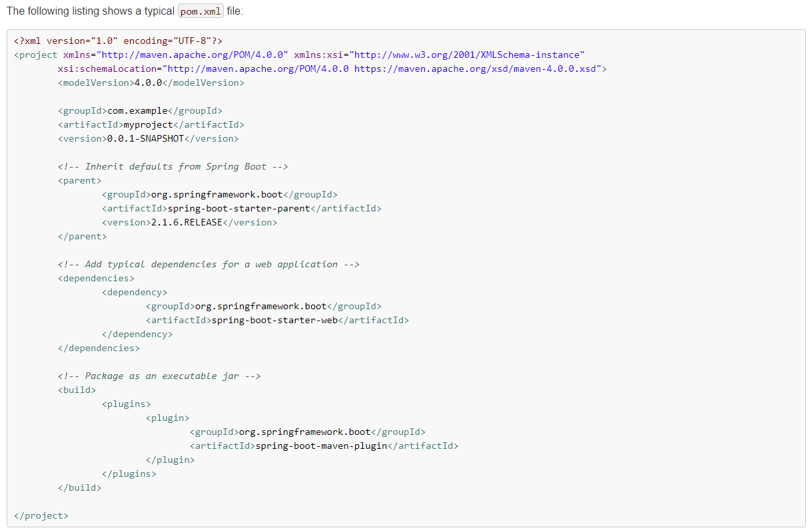

**SpringBoot简介：**

SpringBoot说明文档：https://docs.spring.io/spring-boot/docs/2.1.6.RELEASE/reference/html/

mbatis说明文档：http://mybatis.org/spring/zh/getting-started.html

spring整合mybatis：https://blog.csdn.net/weixin_43823808/article/details/114746421

http://mybatis.org/spring/zh/getting-started.html

## 1、实现步骤

1、创建maven项目

2、导入SpringBoot起步依赖

3、定义controller

4、编写引导类

5、启动测试

依赖文件如下（SpringBoot说明文档中可查找）：

Spring boots 三层架构

