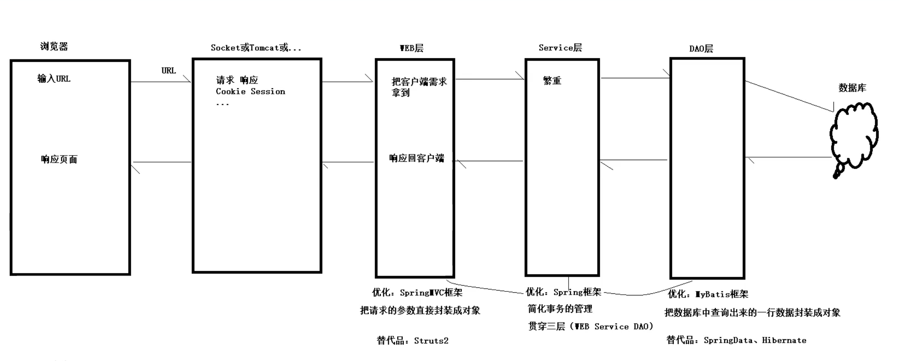

**SpringBoot简介：**

SpringBoot说明文档：https://docs.spring.io/spring-boot/docs/2.1.6.RELEASE/reference/html/

mbatis说明文档：http://mybatis.org/spring/zh/getting-started.html

spring整合mybatis：https://blog.csdn.net/weixin_43823808/article/details/114746421

http://mybatis.org/spring/zh/getting-started.html

**黑马程序员SSM框架教程_Spring+SpringMVC+Maven高级+SpringBoot+MyBatisPlus企业实用开发技术**：https://www.bilibili.com/video/BV1Fi4y1S7ix/?spm_id_from=333.999.0.0&vd_source=c72f3b18d4102d04acc65f53171cc909

**黑马程序员新版Spring零基础入门到精通**：https://www.bilibili.com/video/BV1rt4y1u7q5/?spm_id_from=333.999.top_right_bar_window_view_later.content.click&vd_source=c72f3b18d4102d04acc65f53171cc909

## 1、创建项目

1、创建maven项目

2、导入SpringBoot起步依赖

3、定义controller

4、编写引导类

5、启动测试

依赖文件如下（SpringBoot说明文档中可查找）：

## 2、SSM

SSM：Spring  + Spring MVC + MyBatis

