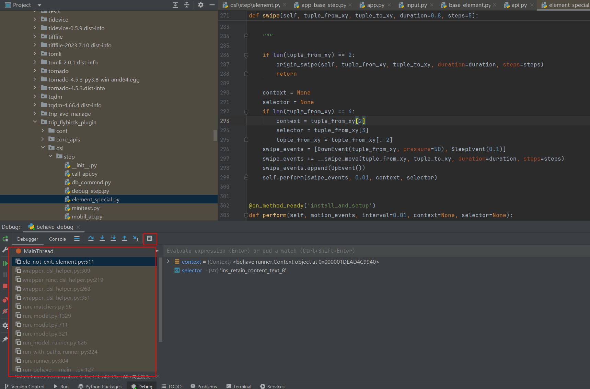
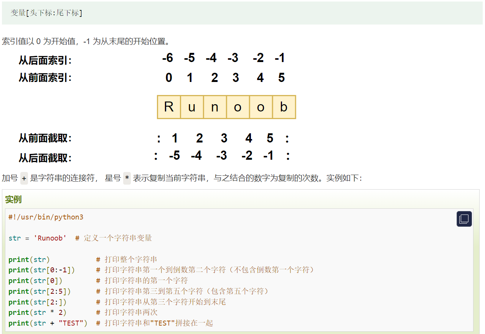
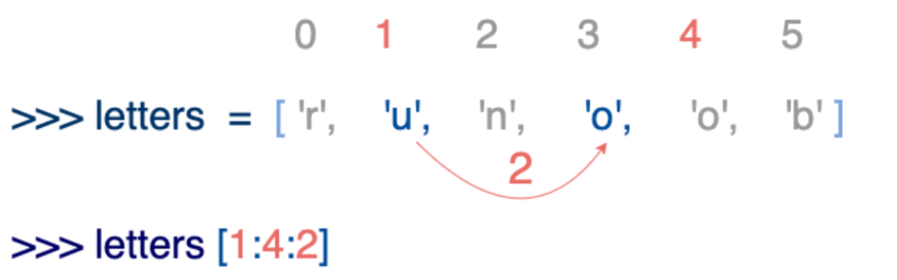

## 1、python基础

菜鸟教程：https://www.runoob.com/python3/python3-tutorial.html

Python3 的六个标准数据类型中：

- **不可变数据（3 个）：**Number（数字）、String（字符串）、Tuple（元组）；

- **可变数据（3 个）：**List（列表）、Dictionary（字典）、Set（集合）。

  
  
  公司github账号：
  
  yong.peng@trip.com
  
  Shangahi2024~
  
  

### 1.1、pycharm**基础知识：**

1、debuger能看到代码执行链路

2、Evalute能执行并查看代码属性




### 1.1、**基础知识：**

- Python 中单引号 **'** 和双引号 **"** 使用完全相同。
- 反斜杠可以用来转义，使用 **r** 可以让反斜杠不发生转义。 如 **r"this is a line with \n"** 则 **\n** 会显示，并不是换行。
- Python 中的字符串有两种索引方式，从左往右以 **0** 开始，从右往左以 **-1** 开始。
- Python 中的字符串不能改变。
- 在Python 3里，只有一种整数类型 int，表示为长整型，没有 python2 中的 Long。
- *Python3 中，bool 是 int 的子类，True 和 False 可以和数字相加，* **True==1、False==0** *会返回* **True***，但可以通过* **is** *来判断类型。*内置的 type() 函数可以用来查询变量所指的对象类型。

#### 1.1.1、self和init详解

1、当创建一个类的实例时，python中的`__init__`方法会自动调用，其主要作用是初始化实例的属性。在实例被创建后，你可以通过这些属性对实例进行操作。每个类可以定义多个不同的`__init__`方法，但通常情况下，在类中只有一个`__init__`方法，在这种情况下，在创建类的实例时，必须提供所需的参数（未设置default值的参数必传）

2、self`是一个类的实例，代表当前对象。它用于访问类的属性和方法。

如：self.fps = fps 、 self.writer = self.process.stdin

通过使用`self`，可以在类的方法中访问和修改对象的状态，并且在方法之间共享数据

而`h_st`等是一个局部变量，它的值在方法内部计算并使用，不需要在整个类中共享。因此，它不需要使用`self`来引用。

当变量只在方法内部使用，并且**不需要在其他方法或类的外部访问时**，可以将其定义为**局部变量**，而不是**类的属性**。这样可以提高代码的可读性和维护性，并且减少不必要的命名冲突。

只有当变量需要在类的**多个方法之间共享**，并且需要在**类的外部访问**时，才将其定义为类的属性，使用`self`来引用。

```python

class FfmpegVidWriter:
    """
    Generate a video using FFMPEG.
    """
    def __init__(self, outfile, width, height, fps=10, orientation=0):
        self.fps = fps

    def process_frame(self, frame):
        assert len(frame.shape) == 3
        self.orientation == 1
        h_st = max(self.cache_frame.shape[0]//2 - frame.shape[0]//2, 0)
        self.cache_frame[h_st:h_ed, w_st:w_ed, :] = frame[:(h_ed-h_st), :(w_ed-w_st)]
        return self.cache_frame.copy()

```


### 1.2、基础应用：


#### 1.2.1**字符串切片操作：**




#### 1.2.2**列表截取**

Python 列表截取可以接收第三个参数，参数作用是截取的步长，以下实例在索引 1 到索引 4 的位置并设置为步长为 2（间隔一个位置）




输出结果为[o,u]


## 2、python进阶

python进阶知识

### 2.1、闭包

