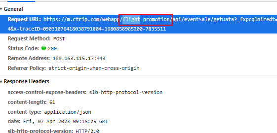

# 人工智能学习

## chatgpt：

ChatGPT 基于 GPT-3.5 模型，使用了大量的自然语言处理和机器学习技术。如果您想要学习相关的技术，以下是一些建议：

1. 自然语言处理：自然语言处理是 ChatGPT 的核心技术之一，您可以学习一些基础的自然语言处理技术，例如分词、词性标注、句法分析、语义分析、情感分析等。Python 是自然语言处理领域使用最广泛的编程语言，您可以使用 Python 学习自然语言处理。一些常用的自然语言处理工具包包括 NLTK、spaCy 和 TextBlob 等。
2. 机器学习：机器学习是 ChatGPT 的另一个重要技术，您可以学习一些基础的机器学习技术，例如监督学习、非监督学习和强化学习等。Python 和 R 是机器学习领域最常用的编程语言，您可以使用这些语言来学习机器学习。一些常用的机器学习工具包包括 Scikit-learn、TensorFlow 和 PyTorch 等。
3. 深度学习：深度学习是 ChatGPT 的核心技术之一，您可以学习一些基础的深度学习技术，例如神经网络、卷积神经网络和循环神经网络等。Python 和 TensorFlow 是深度学习领域最常用的编程语言和框架，您可以使用这些语言和框架来学习深度学习。

ai工具：stable diffusion、lora（绘画增强）、midjourney、runway

33252

