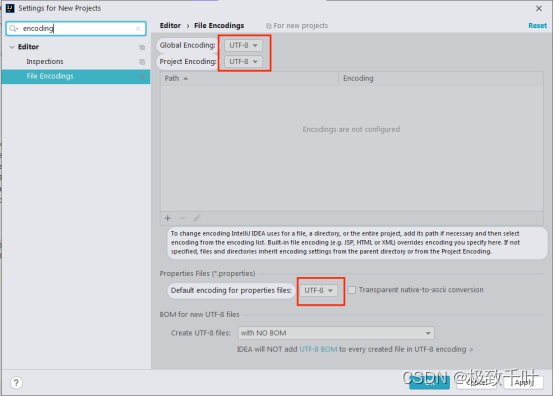

# 工具说明

```
content_type, create_type, theme, title, image_count, image_type, image_style, content_template,
search_key, content_id, image_url, review_status, remark, display_lowest_price, datachange_lastuser, datachange_lasttime,
min_words, max_words
```

## 1、idea快捷键

https://blog.csdn.net/he_xin2009/article/details/124289128

ctrl+shift+R 全局搜索

Ctrl + D：复制行

Ctrl + Shift + C：复制文件路径

Ctrl + Z：撤销
撤销上一步操作内容。

Ctrl + Shift + Z：重做
恢复上一步撤销内容。

Ctrl + Alt + / ：查询接口，需要idea装RestfulTool

mybatis 插件：ALT + enter 可从mapper中直接生成SQL格式语句

ctrl alt +L 自动格式化代码

Ctrl Alt + O 删除非依赖包

替换所有当前关键字	shift+ F6

删除当前行	ctrl + d

复制当前行到下一行	ctrl + ↓

补全代码	alt + /

添加注释或取消	ctrl + /

自动导包（需要先设置）	alt + Enter

自动调整代码格式	ctrl + shift + L

运行代码	ctrl + R

构造器生成、get、set方法、 toString 、在pom.xml文件中快捷配置依赖	alt + insert

查看类的层级关系（光标放在该类上）	ctrl + H

定位到方法（光标放在方法上）	ctrl + B

自动的分配变量名	.var

撤回上一步操作	shift + Backspace / ctrl + Z

取消撤回	ctrl +shift + Z

异常处理	alt + ctrl + t

大小写转换	ctrl + shift + u

加入@Test注解解决飘红	Alt + Enter

包的重命名	shift + F6

多行输入	alt + 鼠标左键

查看所有的快捷键	ctrl + j

增强for循环	循环的对象 + .i / + .for：


谷歌浏览器：

ctrl+shift+t 恢复关闭页面


解决idea中的乱码问题：

设置解码格式为UTF-8




**pojo to json** 插件可直接将.java类型准换为json类型，方便postman和堡垒请求测试时使用。


