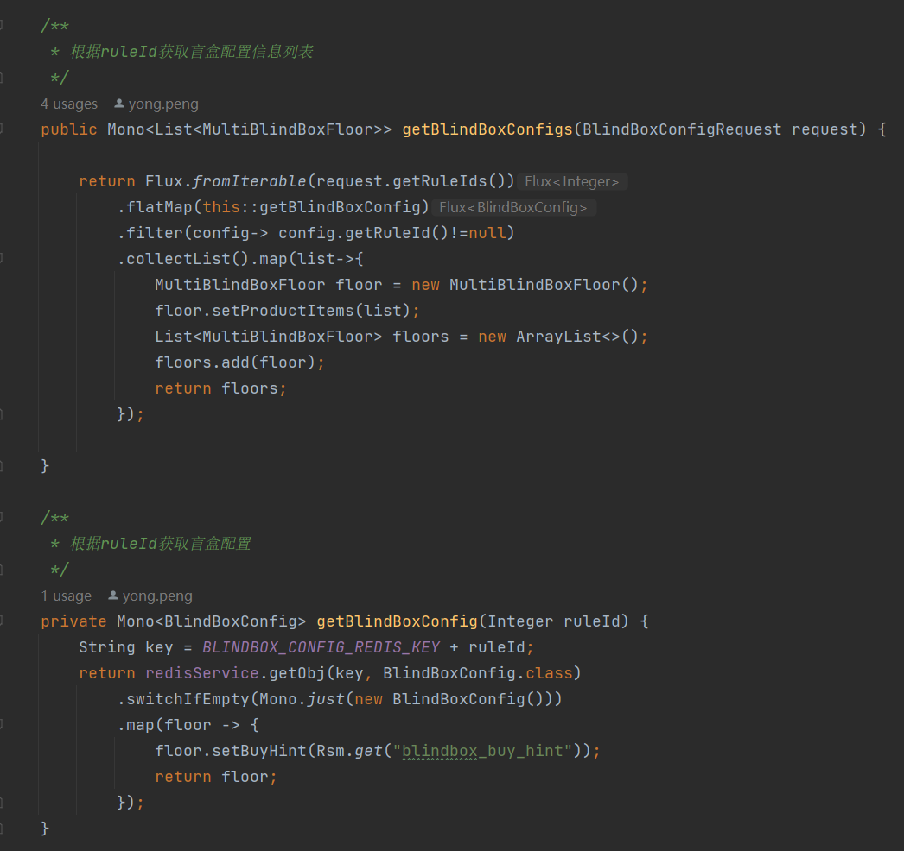
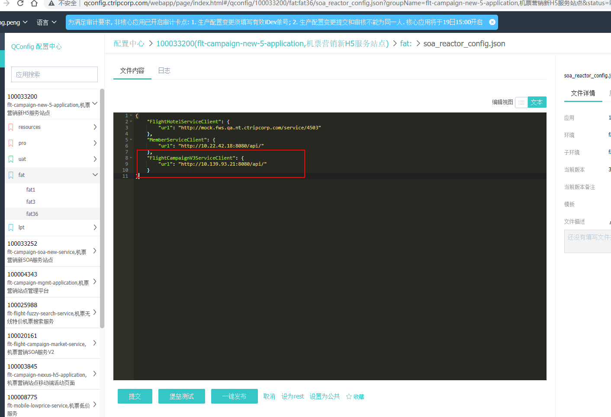
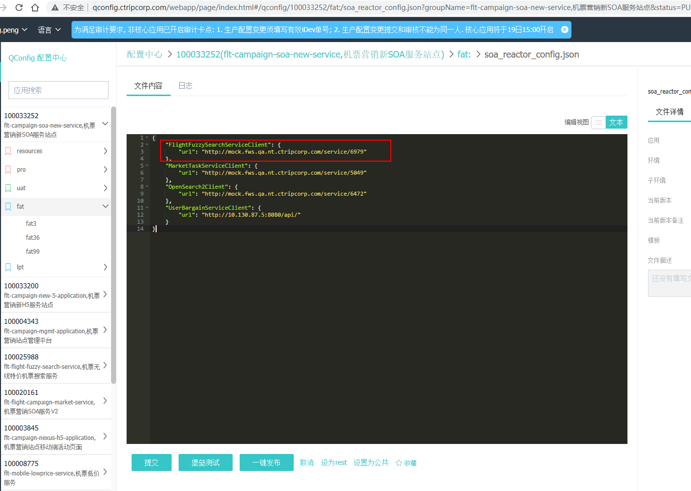

# 开发相关

代码库：http://git.dev.sh.ctripcorp.com/flight-campaign-nexus/app-management-nexus

java --- xml --- mapper --- service --- controller --- request


## 一、环境配置

1、需要在idea中配置maven 

maven地址：E:\DevelopmentTools\apache-maven-3.9.0\conf


1、数据库添加字段需要使用小写+_的写法

如intended_destion

新建表：http://idb.ops.ctripcorp.com/#/dds

查询表：http://dottest.ops.ctripcorp.com/ （显示上限为1000条）

常用sql语句：

select * from es_tab order by TabID desc


2、maven要重新配置


3、jdk要选择open1.8 （**已安装证书**）


实例化方法要保持一致！


**修改表**后点击重新编译即可：

不要删除原始新建的发布单


创建集合对象

```java
    public List<Tab> getList(Map<String, Object> condition) {
        return tabDataLoader.searchByCondition(condition);
    }
```


复航榜&免签/落地签：

新加类型：复航榜、免签&落地签榜

新加字段：标签（tags）、国家（countryName）、复航信息提示（desc）、

当前最低价（thisYearLowestPrice）、去年最低价（lastYearLowestPrice）、

仅看直飞：请求传参为lowPriceSearchAsync，**"TransferType"**: "ANY" 为不限制，DIRECT为直飞

https://m.ctrip.com/webapp/flightcms/active/b3db8826d7d17d1967d847e8488695f3

https://m.ctrip.com/webapp/flightactivity/muse/themeBoard.html?Channel=LowPriceListH5&departCityCode=BJS&departCityName=%E5%8C%97%E4%BA%AC&dayOfWeek=&tripType=1&dDate=2023-04-06&aDate=2023-07-06&BoardNumber=recoverFlight&newVersion=T&s_guid=af257ab5-24b6-4e96-908b-f10d42fba711

http://contract.mobile.flight.ctripcorp.com/#/operation-detail/274/43/fuzzySearch?lang=zh-CN

http://idev.ctripcorp.com/share/prod-requirement/1052/2342597?kanban=41706


**JSONUtil.toJSONString(request)** 可在debug时将请求.java类型转换为json格式，方便postman或者请求堡垒时使用。

```
//        String s = JSONUtil.toJSONString(request);
```


通过堡垒测试验证接口传参


IDEA乱码时设置File Encoding 格式为UFT-8


xml和mapper中 返回结果的类型必须对应


如需返回中文提示可进行封装后获取

写完代码后需ctrl + alt + l 自动优化代码结构


**解决依赖包冲突问题：**


先exclusion然后重新导入（如果exclusion不影响代码运行则不需要重新导入）


**字符串判空：**

1、字符串判断不为空需要用：


**es日志模糊搜索：**

stored_soa_request_body like '%上海%'


**debug时查看sql语法需要修改logback文件：**

```xml
  <logger name="com.ctrip.flight.campaign.mapper.hive.InlandLowPriceArlineMapper" level="debug">
    <appender-ref ref="STDOUT"/>
  </logger>
```

select DISTINCT flightway AS tripType, departcityname AS depCityName, arrivecityname AS arrCityName, dcity AS depCity, acity AS arrCity, flightno, AS flightNo, departdate AS departDate, economy_lowprice AS currentPrice, cf_cabin AS premiumCabin, lowprice_diff AS lowPriceDiff, lowprice_ratio AS lowPriceRatio, depart_airportname AS departureAirport, arrive_airportname AS arrivalAirport, departtime AS departureTimes, arrivetime AS arrivalTimes, transfertype AS transferType, airlinename AS airlineName, depart_provincename AS departProvinceName, arrive_provincename AS arriveProvinceName, depart_regionname AS departRegionName, arrive_regionname AS arriveRegionName, arrivedate AS arrivalDate, transfer_cityname AS outboundTransferCity from dw_fltdb.edw_log_sch_flt_inland_economycabin_cfcabin_lowpricediff_airline WHERE (dcity in ( 'SHA' ) and acity in ( 'SEL' ) ) and departdate >= '2023-08-19' and departdate <= '2023-08-31' and airlinename in ( 中国东方航空股份有限公司' , '东方航空' ) and (depart_airportname in ( '浦东国际机场' ) and arrive_airportname in ( '京大兴国际机场' ) ) and lowprice_diff >= 100 and lowprice_diff <= 500 and economy_lowprice >= 100 and economy_lowprice <= 5000 and triptype = '单程' and cf_cabin like concat('%',头等舱,'%') and depart_provincename != arrive_provincename and d = '2023-08-26' and h = '17' order by rank ASC limit 1000 

SHA(String), SEL(String), 2023-08-19(String), 2023-08-31(String), 中国东方航空股份有限公司(String), 东方航空(String), 浦东国际机场(String), 北京大兴国际机场(String), 100(BigDecimal), 500(BigDecimal), 100(BigDecimal), 300(BigDecimal), 头等舱(String), 2023-08-26(String), 17(String)


**设置log：**

```java
    @RequestMapping(value = "/getAiContent", method = RequestMethod.POST)
    @ResponseBody
    public ServerResponse getAiContent(@RequestBody AICampaignGetAIContentRequest request) {
        if (request == null) {
            return ServerResponse.createByErrorMessage("request not be null", null);
        }
        if (OnlineCollectionUtil.isNullOrEmpty(request.getAirlineBasicInfo())) {
            return ServerResponse.createByErrorMessage("airline basic info not be null", null);
        }
        try {
            AiCampaignContent content = aiCampaignConfigService.getAiContent(request);
            return ServerResponse.createBySuccessData(content, null);
        } catch (Throwable throwable) {
            log.error("[[title=getAiContent]]exception", throwable);
            return ServerResponse.createByErrorMessage(throwable.getMessage(), null);
        }
    }

}


log.warn("[[title=getAiContent]]emptyData,resp={}.",response.getResponseStatus());
aiCampaignContent.setTitle("接口返回异常");
aiCampaignContent.setContent("接口返回异常");
return aiCampaignContent;

```


**只要有get的地方就要确保传值不为空，否则会报空指针异常**


当值为0或者null时返回true：

```java
List<BlindBoxExchangeTime> blindBoxExchangeTimes = rule.getBlindBoxExchangeTimes();
rule.getBlindBoxExchangeTimes().forEach(t -> {
    if(CommonUtil.convertInt(t.getDateType()) == 0){
        blindBoxExchangeTimes.add(t);
    }
});
rule.setBlindBoxExchangeTimes(blindBoxExchangeTimes);
```

什么时候回有nullpointexception：

当对某个对象进行get操作时，此对象为空回产生nullpointexception

比如lowPriceItemType.getPriceDetail()，lowPriceItemType为空时会产生nullpointexpection


Mono返回订阅与发布：




**查询订单数量：**

```java
select * from  p_orders;

select OrderStatus,count(1) from p_orders where OrderDate>='2023-07-05 20:00:00' and  ActivityID ='hdsqxssrmh' group by OrderStatus
```


**随机排序：**

```java
Collections.shuffle(airlineBasicInfos);
```


携程arex自动化测试平台：

技术栈：bytebuddy+ SPI


**根据实验版本号还有币种对数据进行聚合：**


**根据航班的出发到达时间城市等对航班进行聚合：**


**测试环境配置：**

100033200指定特定的100033252测试环境



100033252 指定特定的MOCK套件

http://mock.fws.qa.nt.ctripcorp.com/SOA20/Config/6979




## **二、快捷键**


**idea快捷键：**

https://blog.csdn.net/he_xin2009/article/details/124289128

ctrl+shift+R 全局搜索

Ctrl + D：复制行

Ctrl + Shift + C：复制文件路径

Ctrl + Z：撤销
撤销上一步操作内容。

Ctrl + Shift + Z：重做
恢复上一步撤销内容。

Ctrl + Alt + / ：查询接口，需要idea装RestfulTool

mybatis 插件：ALT + enter 可从mapper中直接生成SQL格式语句

ctrl alt +L 自动格式化代码

Ctrl Alt + O 删除非依赖包

替换所有当前关键字	shift+ F6

删除当前行	ctrl + d

复制当前行到下一行	ctrl + ↓

补全代码	alt + /

添加注释或取消	ctrl + /

自动导包（需要先设置）	alt + Enter

自动调整代码格式	ctrl + shift + L

运行代码	ctrl + R

构造器生成、get、set方法、 toString 、在pom.xml文件中快捷配置依赖	alt + insert

查看类的层级关系（光标放在该类上）	ctrl + H

定位到方法（光标放在方法上）	ctrl + B

自动的分配变量名	.var

撤回上一步操作	shift + Backspace / ctrl + Z

取消撤回	ctrl +shift + Z

异常处理	alt + ctrl + t

大小写转换	ctrl + shift + u

加入@Test注解解决飘红	Alt + Enter

包的重命名	shift + F6

多行输入	alt + 鼠标左键

查看所有的快捷键	ctrl + j

增强for循环	循环的对象 + .i / + .for：

单行注释 ctrl+/

多行注释 ctrl+shift+/

自动注释 /**+enter


**谷歌浏览器：**

ctrl+shift+t 恢复关闭页面


**解决idea中的乱码问题：**

搜索encoding，设置解码格式为UTF-8


**idea常用插件：**

**pojo to json** 插件可直接将.java类型准换为json类型，方便postman和堡垒请求测试时使用。


## 三、函数式编程


