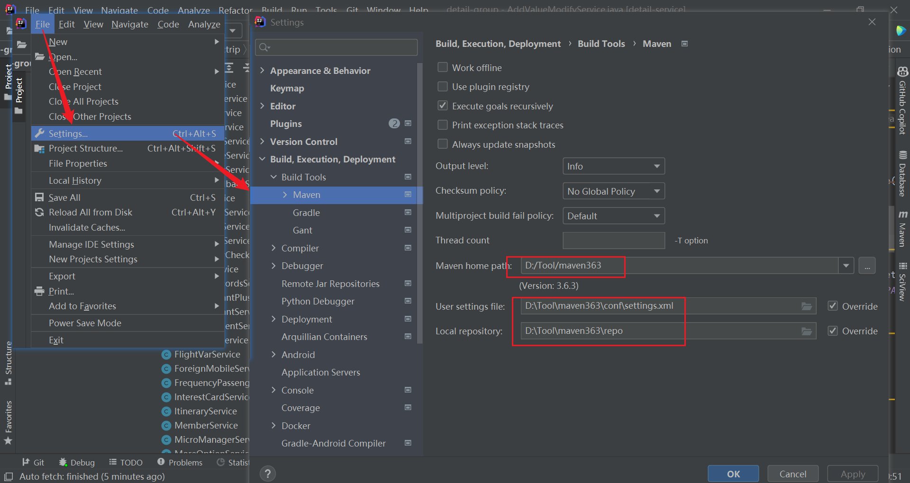
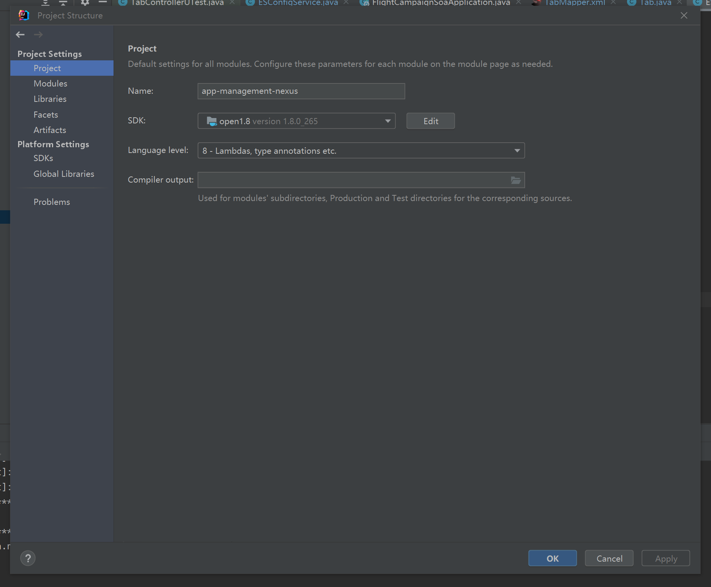

# 开发相关

代码库：http://git.dev.sh.ctripcorp.com/flight-campaign-nexus/app-management-nexus

java --- xml --- mapper --- service --- controller --- request


## 一、环境配置

1、需要在idea中配置maven 

maven地址：E:\DevelopmentTools\apache-maven-3.9.0\conf




1、数据库添加字段需要使用小写+_的写法

如intended_destion

新建表：http://idb.ops.ctripcorp.com/#/dds

查询表：http://dottest.ops.ctripcorp.com/ （显示上限为1000条）

常用sql语句：

select * from es_tab order by TabID desc


2、maven要重新配置


3、jdk要选择open1.8 （**已安装证书**）




实例化方法要保持一致！


**修改表**后点击重新编译即可：

不要删除原始新建的发布单


创建集合对象

```java
    public List<Tab> getList(Map<String, Object> condition) {
        return tabDataLoader.searchByCondition(condition);
    }
```


复航榜&免签/落地签：

新加类型：复航榜、免签&落地签榜

新加字段：标签（tags）、国家（countryName）、复航信息提示（desc）、

当前最低价（thisYearLowestPrice）、去年最低价（lastYearLowestPrice）、

仅看直飞：请求传参为lowPriceSearchAsync，**"TransferType"**: "ANY" 为不限制，DIRECT为直飞

https://m.ctrip.com/webapp/flightcms/active/b3db8826d7d17d1967d847e8488695f3

https://m.ctrip.com/webapp/flightactivity/muse/themeBoard.html?Channel=LowPriceListH5&departCityCode=BJS&departCityName=%E5%8C%97%E4%BA%AC&dayOfWeek=&tripType=1&dDate=2023-04-06&aDate=2023-07-06&BoardNumber=recoverFlight&newVersion=T&s_guid=af257ab5-24b6-4e96-908b-f10d42fba711

http://contract.mobile.flight.ctripcorp.com/#/operation-detail/274/43/fuzzySearch?lang=zh-CN

http://idev.ctripcorp.com/share/prod-requirement/1052/2342597?kanban=41706


**JSONUtil.toJSONString(request)** 可在debug时将请求.java类型转换为json格式，方便postman或者请求堡垒时使用。

```
//        String s = JSONUtil.toJSONString(request);
```


通过堡垒测试验证接口传参


IDEA乱码时设置File Encoding 格式为UFT-8


xml和mapper中 返回结果的类型必须对应


如需返回中文提示可进行封装后获取

写完代码后需ctrl + alt + l 自动优化代码结构


