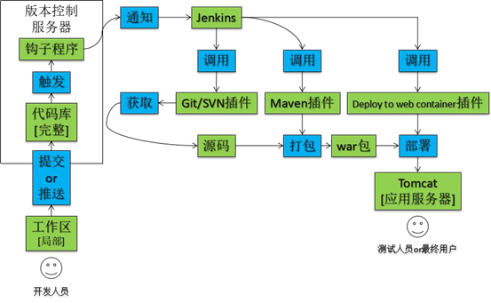
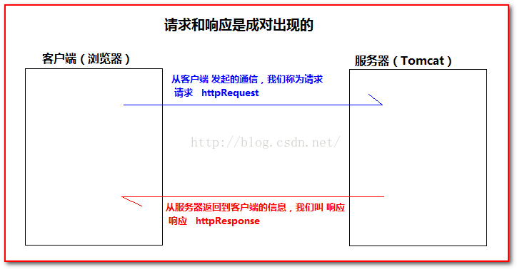
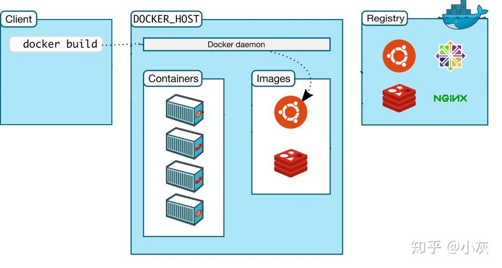
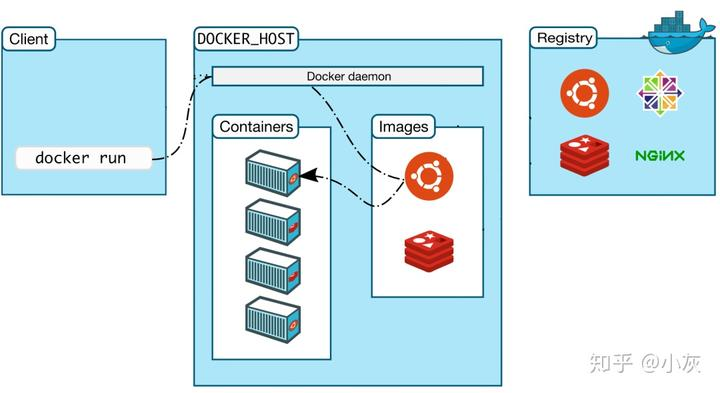
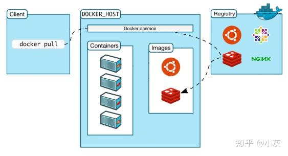

## 1、jekins

官方文档：https://www.jenkins.io/zh/doc/pipeline/tour/getting-started/

参考文章：https://blog.csdn.net/qq_54796785/article/details/133898115

https://blog.csdn.net/qq_43123480/article/details/124110388

Jenkins是使用Java编写的持续集成的工具，可用于自动化各种任务，如构建，测试和部署软件。

持续集成，就是通常所说的CI（Continues Integration），持续集成是一种软件开发实践，开发成员经常集成他们的工作，每天可能会发生多次集成。每次集成都通过自动化的构建（包括编译，发布，自动化测试）来验证，从而尽快地发现集成错误。

Jenkins的三大概念
     **Job（工程/项目）**：在jenkins平台中，都是以Job(任务/工程)为单位去完成一件事的；在使用Jenkins是，都会在管理界面创建一个job/item，在job/item中组织任务。

​     **plugin(插件)**：jenkins提供平台，集成各类插件来完成一个Job。想用jenkins平台来作什么，先找找有没有相应的插件。如：windows命令、linux命令的支持、svn和git代码获取、邮件发送等；这些功能都需要安装相应的插件才能在Jenkins当中使用这些功能。

​	 **workspace(工做空间)**：jenkins是经过文件形式来存储和管理数据的，workspace即给jenkins指定一个专门的目录来存储其全部的配置和数据；jenkins的workspace是根目录。每一个Job都有属于本身的workspace(任务之间互不相干)

自动化部署流程：

准备工作 Jenkins服务器搭建、WEB发布服务器(Tomcat)搭建、SVN代码托管服务器搭建、JDK安装、Maven安装

## 2、tomcat

参考文档：https://blog.csdn.net/love_Aym/article/details/80613183

Tomcat 是由 Apache 开发的一个 Servlet 容器，是开源的轻量级javaWeb容器（服务器）。

Java web，是用java技术来解决相关web互联网领域的技术的总称。web包括：web服务器和web客户端两部分。（使用java语言实现浏览器可以访问的程序内容。称之为Java Web）

**web资源分类:**

所谓web资源即放在Internet网上供外界访问的文件或程序，又根据它们呈现的效果及原理不同，将它们划分为静态资源和动态资源。

**静态web资源** ：固定不变数据文件（静态网页 HTML、CSS文件、文本、音频、视频）

**静态web技术** ：HTML+CSS+JavaScript

**动态web资源** ：一段服务程序，运行后，生成的数据文件

**动态web技术**：servlet，jsp，php， .net ,ruby、python等等

## 3、Docker

**Docker 教程：** https://www.w3cschool.cn/docker/docker-tutorial.html

Docker 是一个开源的应用容器引擎，基于 Go 语言 并遵从Apache2.0协议开源。Docker 可以让开发者打包他们的应用以及依赖包到一个轻量级、可移植的容器中，然后发布到任何流行的 Linux 机器上，也可以实现虚拟化。

容器是完全使用沙箱机制，相互之间不会有任何接口（类似 iPhone 的 app）,更重要的是容器性能开销极低。

- dockerfile、image、container

  可以简单的把**image**理解为**可执行程序**，**container**就是运行起来的**进程**。类似写程序需要源代码，那么“写”image就需要dockerfile，**dockerfile**就是image的**源代码**，**docker**就是"**编译器**"。因此我们只需要在dockerfile中指定需要哪些程序、依赖什么样的配置，之后把dockerfile交给“编译器”docker进行“编译”，也就是docker build命令，生成的可执行程序就是image，之后就可以运行这个image了，这就是docker run命令，image运行起来后就是docker container。

- docker是如何工作的

  实际上docker使用了常见的CS架构，也就是client-server模式，docker client负责处理用户输入的各种命令，比如docker build、docker run，真正工作的其实是server，也就是docker demon，值得注意的是，docker client和docker demon可以运行在同一台机器上。

- **docker build** 

  写完dockerfile交给docker“编译”时使用这个命令，那么client在接收到请求后转发给docker daemon，接着docker daemon根据dockerfile创建出“可执行程序”image。

  

- **docker run**

  有了“可执行程序”image后就可以运行程序了，接下来使用命令docker run，docker daemon接收到该命令后找到具体的image，然后加载到内存开始执行，image执行起来就是所谓的container。

  

- **docker registry**

  docker registry 可以用来存放各种image，公共的可以供任何人下载image的仓库就是docker Hub。那么该怎么从Docker Hub中下载image呢，需要用到docker pull命令。

  

**docker的底层实现**

docker基于[Linux](https://www.zhihu.com/search?q=Linux&search_source=Entity&hybrid_search_source=Entity&hybrid_search_extra={"sourceType"%3A"article"%2C"sourceId"%3A"187505981"})内核提供这样几项功能实现的：

- **NameSpace**
  我们知道Linux中的PID、[IPC](https://www.zhihu.com/search?q=IPC&search_source=Entity&hybrid_search_source=Entity&hybrid_search_extra={"sourceType"%3A"article"%2C"sourceId"%3A"187505981"})、网络等资源是全局的，而[NameSpace机制](https://www.zhihu.com/search?q=NameSpace机制&search_source=Entity&hybrid_search_source=Entity&hybrid_search_extra={"sourceType"%3A"article"%2C"sourceId"%3A"187505981"})是一种资源隔离方案，在该机制下这些资源就不再是全局的了，而是属于某个特定的NameSpace，各个NameSpace下的资源互不干扰，这就使得每个NameSpace看上去就像一个独立的操作系统一样，但是只有NameSpace是不够。
- **Control groups**
  虽然有了NameSpace技术可以实现资源隔离，但进程还是可以不受控的访问系统资源，比如[CPU](https://www.zhihu.com/search?q=CPU&search_source=Entity&hybrid_search_source=Entity&hybrid_search_extra={"sourceType"%3A"article"%2C"sourceId"%3A"187505981"})、内存、磁盘、网络等，为了控制容器中进程对资源的访问，Docker采用control groups技术(也就是[cgroup](https://www.zhihu.com/search?q=cgroup&search_source=Entity&hybrid_search_source=Entity&hybrid_search_extra={"sourceType"%3A"article"%2C"sourceId"%3A"187505981"}))，有了cgroup就可以控制容器中进程对系统资源的消耗了，比如你可以限制某个容器使用内存的上限、可以在哪些CPU上运行等等。

有了这两项技术，容器看起来就真的像是独立的操作系统了。

