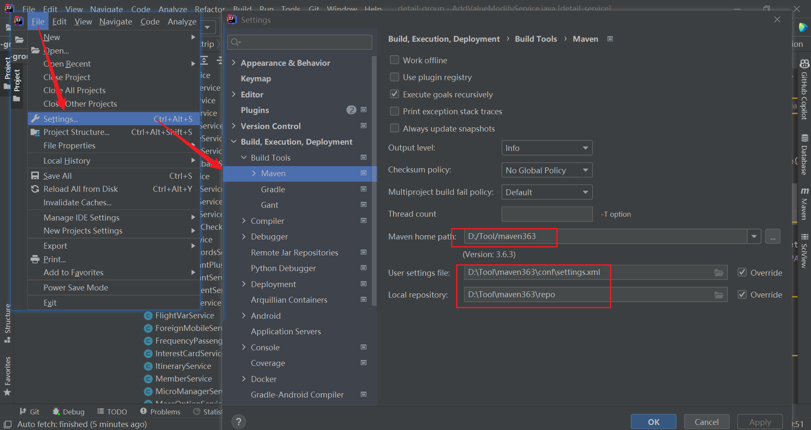
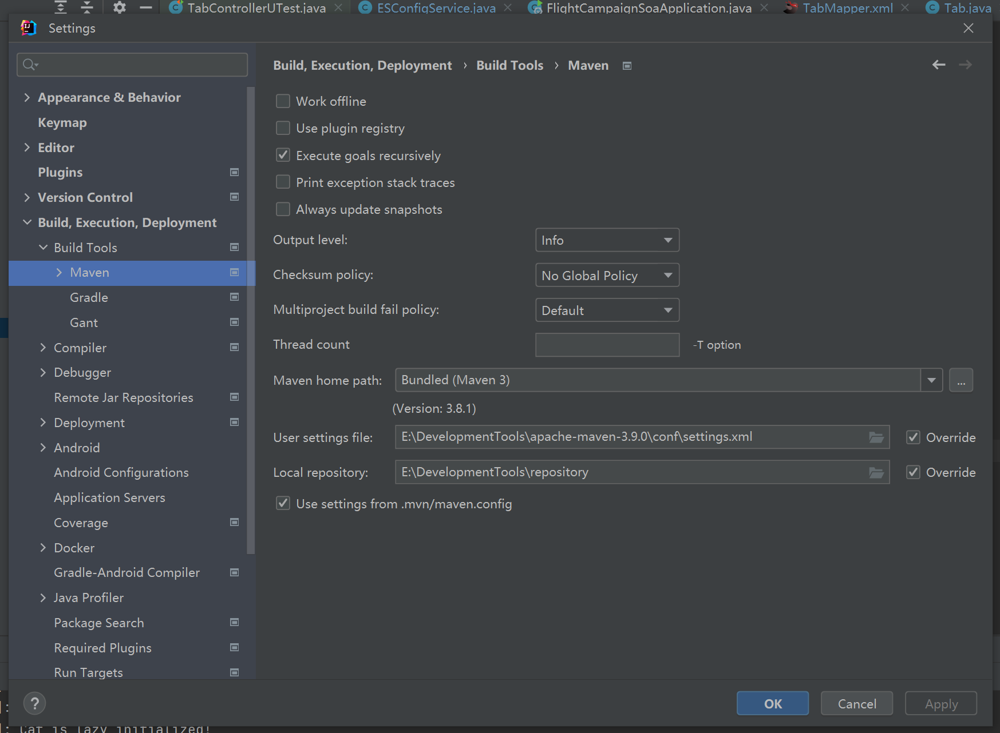
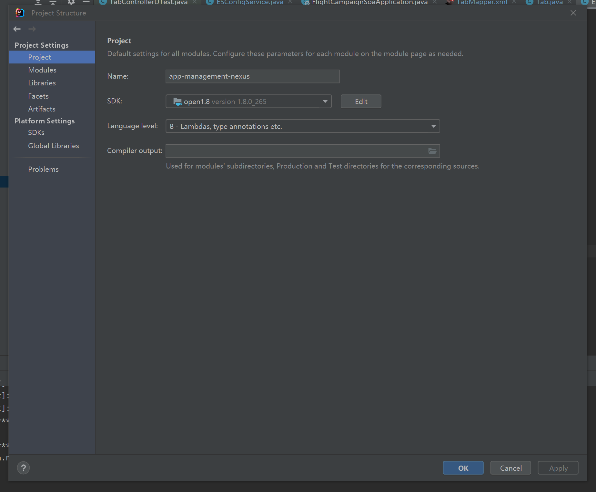

## 项目相关

## 1、项目进度

ToDo：

【特价】特价集合列表强化日期样式&新增推荐排序

 http://idev.ctripcorp.com/share/prod-requirement/2117/2266762?kanban=40878

【营销】复航榜榜单开发 

100033252 (新SOA)：http://git.dev.sh.ctripcorp.com/flight-campaign-nexus/flight-campaign-soa-reactor -- 参考营销已有榜单

【低价订阅】前置乘机人2.0 http://idev.ctripcorp.com/share/prod-requirement/10000551/2274833?kanban=40500

【低价订阅】主流程轻量化订阅

【首页】工具去&行程卡片新增出行商城入口+工具区新增“临时乘机证明”小工具

小程序编辑页产品验收后开流量！！！


Doing
【低价订阅】小程序编辑页两端统一 

【特价】特价集合页一期迭代优化需求

【营销】国际秒杀迭代

【营销】活动落地页导航栏隐藏


Done：

【低价订阅】小程序编辑页两端统一 


长期：
【常规测试】低价订阅+首页+特价+营销（模糊搜索为IBU&FBU共用）

【测试说明】服务探索+营销+详情退改


**生产账号：**

uid：ftest001 老客 一级标签：流失 二级标签：高价值
uid：ftest002 老客 一级标签：流失 二级标签：高价值
uid：ftest003 新客 一级标签：流失 二级标签：高价值
uid：ftest004 老客 一级标签：成熟 二级标签：无标识

彭：13134256596/M3033475677/Shanghai2010   老客 一级标签：流失 二级标签：高价值
覃：18372565626/M2589202763/Shanghai2010    老客 一级标签：流失 二级标签：高价值
娟：17383246644/M4552960508/Shanghai2010


**线上测试账号**

testflight01，testflight01
testflight02，Ctrip8888
testflight03，chen2010
wwwwww，good08


**测试账号：**

guanweirong1/123456 UID：guanweirong1  --- 老客　
13437251111/cs123456 UID：M2254333490 --- 老客
13437251113/cs123456 UID：M2254331678 --- 老客
13437251114/cs123456 UID：M2254334336 --- 老客
guanweirong3/123456 新客
guanweirong5/123456 新客
guanweirong7/123456 新客


**CID：**

Iphone6 Plus Client id：12001122210000143443
Iphone6 Plus Client：12001082110000072826（管爷）
iphonex：12001102810000100010（戴总） 52271134311147150528
荣耀10 Client id：32001177710000100015（测试）
荣耀10 Client id：32001149710235325641（生产）
Redmi Note9 Pro：32001096610000106262（测试）52271018411074480389（小程序）


**堡垒查询：**

查询用户标签：
http://canary.ctripcorp.com/#!/soa?state=456C4oKGw6HgpKDimKDiuJDhhoDgs63niITsloPjgoDhqJDZsOGTgOKcgO2whOuAmO2TheSMquutiOGhgOetmOGpjTjvoIHmkKLkio3nqIDuk4DWse6IgOGigOGsgOK4geWWmFfih4DhprXklqTMqei1ouOmuO2IgeqViNO05IiH5ouqx4xb4qCH5ISb5rCA6rq147Sd6ZW96aa955e15KeN5aC94qaQ47KC5Iio7Iu04LKj7qOM5LeoVOawoO6QgOqzgeKjgOSAgeeyieyliMSd57Sj6ZCA4pWI7Ia57KaJ4YCB65WB5KCA7rOAwozgt6DhhpXsparooIHqta3hhrvntJXhkonorJXmrqfmnJXkqIHnkonmo4Hnr4jmtozqoKnhoYHnt4nhl63ttpTigJDHqOa7kOOwgeOgge2gvOuGkdC8xZnhuJDvpZHvuLfSqOWtgumSiuaViOOcsumEg_iel_KGgemTlOC4t_Wjq_2Wk_2kquKNquKkkuiph_WEneyooOSqjeS6oMiS7oeY6YOADuudgEfkuqTptpjskKbkiI7pu5XqkLLhpYzptLLouq7omYHjirnnk7XqtLTqiKXqhLjnq4og6ZCO4L2j5I6g64KYG_OIjOyroO6Age21peeNqOOdmOiyoe2vkO2rg_WGqeGSpAA


## 2、开发相关

代码库：http://git.dev.sh.ctripcorp.com/flight-campaign-nexus/app-management-nexus

java --- xml --- mapper --- service --- controller --- request


1、需要在idea中配置maven 

maven地址：E:\DevelopmentTools\apache-maven-3.9.0\conf




setting.xml

```xml
This XML file does not appear to have any style information associated with it. The document tree is shown below.
<settings xmlns="http://maven.apache.org/SETTINGS/1.0.0" xmlns:xsi="http://www.w3.org/2001/XMLSchema-instance" xsi:schemaLocation="http://maven.apache.org/SETTINGS/1.0.0 http://maven.apache.org/xsd/settings-1.0.0.xsd">
<!-- 
     localRepository是设置本地仓库地址的。默认位置为: ${user.home}/.m2/repository/
     Windows 参考格式：<localRepository>d:/repository</localRepository>
     Linux 参考格式：<localRepository>$HOME/repository</localRepository>
      -->
<localRepository>${user.home}\.m2\repository\</localRepository>
<!-- 每个pluginGroup元素都包含一个groupId，当你在命令行中没有提供插件的groupid时，将会使用该列表。
         这个列表自动包含org.apache.maven.plugins和org.codehaus.mojo -->
<pluginGroups> </pluginGroups>
<mirrors>
<mirror>
<id>nexus</id>
<mirrorOf>*</mirrorOf>
<name>public</name>
<url>http://maven.release.ctripcorp.com/nexus/content/groups/public</url>
</mirror>
</mirrors>
<!-- POM中的repositories和distributionManagement元素为下载和部署定义的仓库。
         一些设置如服务器的用户名和密码不应该和pom.xml一起分发。
         这种类型的信息应该存在于构建服务器上的settings.xml文件中 -->
<servers>
<server>
<id>releases</id>
<username>admin</username>
<password>admin123</password>
</server>
<server>
<id>snapshots</id>
<username>admin</username>
<password>admin123</password>
</server>
</servers>
<!-- 这里的profile元素是pom.xml的profile元素的一个裁剪版本 -->
<profiles xmlns="">
<profile>
<id>Ctrip</id>
<repositories>
<repository>
<id>public</id>
<name>all repoes</name>
<url>http://maven.release.ctripcorp.com/nexus/content/groups/public</url>
<releases>
<enabled>true</enabled>
<checksumPolicy>warn</checksumPolicy>
</releases>
<snapshots>
<enabled>true</enabled>
<updatePolicy>always</updatePolicy>
<checksumPolicy>fail</checksumPolicy>
</snapshots>
</repository>
</repositories>
<pluginRepositories>
<pluginRepository>
<id>Ctrip</id>
<url>http://maven.release.ctripcorp.com/nexus/content/groups/public</url>
<releases>
<enabled>true</enabled>
<checksumPolicy>warn</checksumPolicy>
</releases>
<snapshots>
<enabled>true</enabled>
<updatePolicy>always</updatePolicy>
<checksumPolicy>fail</checksumPolicy>
</snapshots>
</pluginRepository>
</pluginRepositories>
</profile>
</profiles>
<!-- 一直启用id为Ctrip的profile配置 -->
<activeProfiles>
<activeProfile>Ctrip</activeProfile>
</activeProfiles>
</settings>
```

1、数据库添加字段需要使用小写+_的写法

如intended_destion

新建表：http://idb.ops.ctripcorp.com/#/dds

查询表：http://dottest.ops.ctripcorp.com/ （显示上限为1000条）

常用sql语句：

select * from es_tab order by TabID desc


2、maven要重新配置




3、jdk要选择open1.8 （**已安装证书**）



